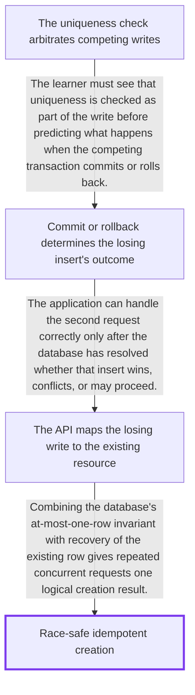

# Race-safe idempotent creation

- **Session:** `1fc8b737-a2f6-4aef-a2d1-03641b86f1dd`
- **Phase:** Complete
- **Created:** 2026-08-24T15:59:34.490Z
- **Updated:** 2026-08-24T16:10:06.053Z
- **Completed:** 2026-08-24T16:10:06.053Z

## Learning target

Understand why a database uniqueness constraint, rather than a pre-insert read alone, makes idempotent creation race-safe when two requests arrive simultaneously and both read that no row exists

## Learner context

Learner understands APIs and basic database reads and writes, but explicitly does not understand the exact concurrency mechanism when both requests read that no row exists

## Probe conclusion

Reported foundation: understands APIs and basic database reads and writes; this is prior context, not assessed evidence. Demonstrated: no substantive concurrency mechanism has yet been assessed. Admitted missing mechanism: how the database arbitrates simultaneous inserts after both requests observe absence. Not yet checked: transfer prediction for commit versus rollback and application handling of a uniqueness conflict.

## Dependency plan

## Admitted gaps

### unique-constraint-arbitration

- **Learner statement:** I do not understand the exact concurrency mechanism when two requests simultaneously read that no row exists
- **Diagnostic evidence:** The learner explicitly identified this as the missing mechanism while reporting familiarity with APIs and basic database reads and writes
- **Classification:** Not an assessment; no grade or retry was created.

## Sources and verification

### [PostgreSQL Documentation: Index Uniqueness Checks](https://www.postgresql.org/docs/current/index-unique-checks.html)

- **Class:** primary
- **Supports:** For an immediate unique index, a would-be inserter encountering the same key from an uncommitted transaction waits; rollback removes the conflict, while commit leads to a uniqueness violation after rechecking.
- **Verification:** Retrieved the official page directly with curl and checked the uncommitted-conflict rules and the statement that uniqueness checking must be integral to index insertion to avoid races.

### [PostgreSQL Documentation: Unique Constraints](https://www.postgresql.org/docs/current/ddl-constraints.html#DDL-CONSTRAINTS-UNIQUE-CONSTRAINTS)

- **Class:** primary
- **Supports:** A unique constraint ensures constrained key values are unique across rows and automatically creates a unique B-tree index in PostgreSQL.
- **Verification:** Retrieved the official constraints page directly with curl and checked the unique-constraint definition, generated index, and NULL portability caveat.

### [SQLite Documentation: Transactions](https://www.sqlite.org/lang_transaction.html#read_transactions_versus_write_transactions)

- **Class:** primary
- **Supports:** Database engines can enforce writer coordination differently: SQLite permits multiple simultaneous readers but only one simultaneous writer, and a competing write upgrade can fail with SQLITE\_BUSY.
- **Verification:** Retrieved the official SQLite transaction page directly with curl and checked its simultaneous-reader and single-writer rules.

### [SQLite Documentation: UNIQUE Constraints](https://www.sqlite.org/lang_createtable.html#unique_constraints)

- **Class:** primary
- **Supports:** SQLite checks UNIQUE constraints as a write-time table invariant and treats duplicate constrained non-NULL value combinations as constraint violations.
- **Verification:** Retrieved the official SQLite CREATE TABLE page directly with curl and checked the UNIQUE constraint and constraint-violation sections.

### [PostgreSQL Documentation: INSERT and ON CONFLICT](https://www.postgresql.org/docs/current/sql-insert.html#SQL-ON-CONFLICT)

- **Class:** primary
- **Supports:** ON CONFLICT turns a unique-constraint conflict into an explicit alternative action; DO NOTHING avoids the second insert, while DO UPDATE guarantees an atomic insert-or-update outcome under high concurrency.
- **Verification:** Retrieved the official INSERT page directly with curl and checked the ON CONFLICT alternative actions, arbiter constraints, atomic high-concurrency guarantee, and RETURNING behavior.

### [PostgreSQL Documentation: Read Committed Isolation](https://www.postgresql.org/docs/current/transaction-iso.html#XACT-READ-COMMITTED)

- **Class:** primary
- **Supports:** Under PostgreSQL Read Committed, ON CONFLICT may resolve against a concurrent row outside the INSERT snapshot; DO NOTHING can suppress insertion even when that row is not visible to the statement, while a later SELECT statement receives a newer snapshot.
- **Verification:** Retrieved the official transaction-isolation page directly with curl and checked the statement-snapshot rule plus the documented ON CONFLICT DO UPDATE and DO NOTHING concurrency behavior.

## Teaching steps

### 1. unique-constraint-arbitration

- **Foundation:** Two independent requests may both complete a SELECT before either transaction commits an INSERT. A SELECT result saying that key K is absent describes what that read can see at that moment; by itself it neither reserves K nor creates an invariant that future writes must obey.
- **Motivation:** If both requests treat the same absence observation as permission to insert, application-level check-then-insert contains a time-of-check/time-of-use gap and can produce duplicate logical creations unless the shared database arbitrates the writes.
- **Explanation:** With an immediate unique constraint on K, uniqueness checking is integrated into the write path. In PostgreSQL, if request B's insert finds the same unique-index key created by request A's still-uncommitted transaction, B waits for A to end and then rechecks visibility. If A commits and keeps the row, B receives a uniqueness violation; if A rolls back, the conflict disappears and B may proceed. Thus both reads may truthfully report absence, but both writes cannot become committed rows with K. Other engines may coordinate writers by different locking or conflict rules; the portable point is that the constraint is enforced at the shared write boundary, not by the earlier application read. This establishes the storage invariant only; mapping the losing request to the existing resource is a later step.
- **Checkpoint:** Assume a PostgreSQL table coupon\_redemptions has an immediate UNIQUE constraint on (account\_id, coupon\_id). Requests A and B simultaneously check whether account 42 has redeemed coupon SAVE10; both SELECTs return no row. A then inserts (42, SAVE10) but has not committed when B attempts the same insert. In your own words, explain what happens to B if A commits, what happens to B if A rolls back, and what guarantee the UNIQUE constraint provides that the two earlier SELECTs did not. Limit your answer to the database concurrency mechanism; do not discuss HTTP response handling yet.

### 2. commit-outcome-branch

- **Foundation:** The previous checkpoint established that an immediate unique-index check can discover a same-key entry created by another transaction even before that transaction commits.
- **Motivation:** The physical presence of an index entry is not yet proof that a conflicting committed row will survive, because the transaction that created the entry may still roll back.
- **Explanation:** The conflict is provisional while the first transaction is active. PostgreSQL therefore waits for that transaction to finish and repeats the visibility check instead of deciding from the raw index entry alone. A commit makes the conflicting row eligible to defeat the second insert; a rollback removes the logical conflict and allows the waiting insert to compete normally. This is why the transaction outcome, not merely which request read or began inserting first, determines the final uniqueness result.
- **Checkpoint:** Assume a PostgreSQL table seat\_reservations has an immediate UNIQUE constraint on (event\_id, seat\_number). Transaction A inserts seat (7, 12) but remains uncommitted. Transaction B attempts the same seat and its unique-index check finds A's entry. An engineer proposes that B should immediately receive a duplicate-key error without waiting, because an index entry already exists. Diagnose the proposal: explain why that immediate decision could be wrong and identify what must happen before PostgreSQL can decide whether B has a real uniqueness conflict. Limit your answer to database transaction state.

### 3. idempotent-conflict-recovery

- **Foundation:** The uniqueness constraint already guarantees that concurrent inserts for the same idempotency key cannot leave two committed rows, and a uniqueness conflict tells the losing request that a competing row won the database arbitration.
- **Motivation:** An unhandled uniqueness violation can still become an application error. That preserves one-row storage safety, but it does not by itself satisfy a contract in which repeated uses of the same idempotency key must resolve to the same logical creation result.
- **Explanation:** For this lesson, idempotent creation means one committed resource per key and every equivalent request with that key resolving to that resource. The database supplies the at-most-one-row invariant. The handler supplies recovery: it treats the specific uniqueness conflict as a concurrent winner, then obtains and returns the row for that key, or uses a suitable atomic ON CONFLICT pattern. In PostgreSQL Read Committed, ON CONFLICT DO NOTHING can suppress the losing insert because of a concurrent row that was not visible to the INSERT statement's snapshot, so a follow-up SELECT is a new statement with a new snapshot. The exact retry and deletion handling depends on the application's transaction design. The earlier pre-read may remain an optimization, but it is not the correctness boundary.
- **Checkpoint:** Assume an orders API defines idempotent creation as follows: equivalent POST requests carrying the same idempotency\_key must resolve to one logical order. The orders table has UNIQUE(idempotency\_key). Requests A and B carry the same key and payload, and both pre-insert SELECTs return no row. A's insert commits order 9001; B's insert waits and then receives the uniqueness conflict. The current handler converts every database exception into HTTP 500. Diagnose why the UNIQUE constraint alone is insufficient for the stated API contract, describe what B's handler should do after this specific conflict, and distinguish the guarantee supplied by the database from the guarantee supplied by the handler.

### 4. race-safe-idempotent-creation

- **Foundation:** The learner has demonstrated three components: an absence read does not reserve a key; the unique write path waits or otherwise arbitrates until transaction outcome is known; and the losing equivalent request must recover the winner's resource.
- **Motivation:** A design still needs a precise correctness boundary when requests run on different threads, processes, or application instances, where a process-local check or lock cannot coordinate every writer.
- **Explanation:** Under the stated assumptions, race-safe idempotent creation places a non-null uniqueness invariant over the complete logical idempotency key in the shared database that all writers use. The pre-read can avoid unnecessary insert attempts in the common case, but correctness does not depend on its result. Each request attempts the constrained write or an atomic ON CONFLICT form. The database permits at most one committed winner for the key; a rolled-back provisional winner leaves room for another request; and the handler maps the committed losing path to the equivalent existing resource. A process-local mutex cannot replace the constraint when another process or instance can write. The full invariant depends on all relevant writes passing through the constraint and on the key actually representing the intended equivalence class.
- **Checkpoint:** Assume two separate API instances receive equivalent requests to create an export job for the same non-null key (account\_id=42, client\_token=T9). The shared PostgreSQL table has an immediate UNIQUE constraint on (account\_id, client\_token). Both instances run a pre-insert SELECT and see no row. Instance A inserts the key but is still uncommitted when instance B attempts its insert. Reconstruct the complete correctness mechanism for both possible outcomes of A's transaction, including what B's handler should do in each case. Then explain why moving the SELECT earlier or adding a mutex inside each individual API process cannot replace the database constraint, and state the final invariant that the combined database-and-handler design provides.

## Active learning checkpoint

- **Status:** Resolved
- **Node:** `race-safe-idempotent-creation`
- **Question ID:** `teach-race-safe-target-1`
- **Kind:** reconstruction
- **Question:** Assume two separate API instances receive equivalent requests to create an export job for the same non-null key (account\_id=42, client\_token=T9). The shared PostgreSQL table has an immediate UNIQUE constraint on (account\_id, client\_token). Both instances run a pre-insert SELECT and see no row. Instance A inserts the key but is still uncommitted when instance B attempts its insert. Reconstruct the complete correctness mechanism for both possible outcomes of A's transaction, including what B's handler should do in each case. Then explain why moving the SELECT earlier or adding a mutex inside each individual API process cannot replace the database constraint, and state the final invariant that the combined database-and-handler design provides.
- **Attempts:** 1
- **Prior question ID:** None
- **Resolved evidence:** `3e48f0a7-f770-4f94-8717-4983605d284a`
- **Mistake type:** None

## Assessments

### Correct — unique-constraint-arbitration

- **Kind:** transfer
- **Evidence:** The learner correctly explained that B waits on A's uncommitted same-key index entry, rechecks after A ends, fails on A commit, may proceed on A rollback, and distinguished read-time visibility from the unique constraint's shared write-time at-most-one-committed-row invariant.
- **Contaminated:** No

### Correct — commit-outcome-branch

- **Kind:** debugging
- **Evidence:** The learner correctly diagnosed that an uncommitted index entry is only a provisional conflict, may disappear on rollback, and therefore requires waiting for A's transaction outcome and rechecking committed conflict state before deciding B's result.
- **Contaminated:** No

### Correct — idempotent-conflict-recovery

- **Kind:** debugging
- **Evidence:** The learner correctly distinguished the database's at-most-one-committed-row invariant from the handler's same-logical-result contract, and specified targeted conflict recovery through a visibility-safe read, request equivalence verification, and returning the winning order rather than an unrelated error.
- **Contaminated:** No

### Correct — race-safe-idempotent-creation

- **Kind:** reconstruction
- **Evidence:** The learner correctly reconstructed simultaneous absence reads, write-time waiting and recheck, commit and rollback branches, winner recovery with equivalence verification, the failure of earlier reads and per-process mutexes across instances, and the final combined invariant of one committed row plus one logical result for equivalent requests.
- **Contaminated:** No

### Correct — whole-system-synthesis

- **Kind:** synthesis
- **Evidence:** The learner connected schema design, a non-null unique event key, payload identity, optional pre-read fast path, constrained write arbitration, wait and recheck, commit and rollback branches, visibility-safe winner recovery, mismatched payload rejection, and the division between the database's at-most-one-row invariant and the handler's one-logical-result contract.
- **Contaminated:** No

## Retention

- **unique-constraint-arbitration:** developing; level 1; due 2026-08-25T16:03:47.200Z
- **Commit or rollback determines the losing insert's outcome:** developing; level 1; due 2026-08-25T16:05:53.636Z
- **The API maps the losing write to the existing resource:** developing; level 1; due 2026-08-25T16:07:36.415Z
- **Race-safe idempotent creation:** developing; level 1; due 2026-08-25T16:08:56.239Z

## Visuals

No visuals recorded.

## Whole-system synthesis

Store event\_id as NOT NULL with a UNIQUE constraint, and store enough payload identity, such as the normalized payload or a stable fingerprint, to verify that reuse of an event\_id is actually equivalent. Each worker may pre-read as a fast path, but then attempts the constrained insert or an atomic ON CONFLICT form. If A has inserted the event\_id but is uncommitted when B inserts, B waits for A's transaction outcome. If A commits, B takes the specific conflict path, performs a visibility-safe read that can see A's committed fulfillment, compares the stored payload identity with B's payload, and returns that one fulfillment when they match. If A rolls back, the provisional conflict disappears, B may insert the fulfillment and return its own committed winner. If the same event\_id carries a mismatched payload, the handler must reject it as conflicting key reuse rather than treating it as an equivalent retry. The database supplies at most one committed fulfillment row per event\_id; the handler supplies equivalence checking and maps all equivalent deliveries to that one result. The pre-read alone cannot supply this guarantee because it is a snapshot observation, not a reservation or an atomic rule governing later writes, so multiple workers can all truthfully observe absence before any commits.

## Unresolved gaps

None recorded.
