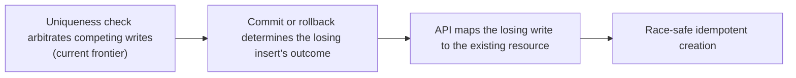

## USER — 2026-08-24T15:58:26.617Z

I want to learn why a database uniqueness constraint, rather than a pre-insert read alone, makes idempotent creation race-safe when two requests arrive simultaneously. I understand APIs and basic database reads and writes, but I do not understand the exact concurrency mechanism when both requests read that no row exists. Do not simulate my replies; ask at most one fully framed question and then wait for my answer. Work in this current learning root and persist every required state transition before advancing. This acceptance run is terminal-only: never use Browser, browser-control, Chrome, Chromium, Playwright, CDP, Oracle, or any browser process. If research is needed, use direct terminal source retrieval only.

## ASSISTANT — 2026-08-24T15:58:31.206Z

I’m using the adaptive-learning skill because you want a durable, stateful teaching session. I’ll first load its rules and current learner state, then I’ll persist the required transition before asking one fully framed question. I’ll stay entirely in the terminal.

## ASSISTANT — 2026-08-24T15:58:37.463Z

I’ve read the bootstrap’s skill-selection rules; the relevant skill is `adaptive-learning`, and I’m using it to structure the explanation, checkpoint your understanding, and keep the learning record consistent.

## ASSISTANT — 2026-08-24T15:58:42.390Z

The superpowers loader does not register this project-local skill, so I’m loading the canonical `.agents/skills/adaptive-learning/SKILL.md` directly, as the repository instructs. This is only a loader mismatch; it does not block the session.

## ASSISTANT — 2026-08-24T15:59:32.708Z

The canonical state has no prior sessions. I’m starting a new session with your exact target and recording your stated gap as an admission—not as a wrong answer or grade.

## ASSISTANT — 2026-08-24T16:00:13.952Z

The gap and probe summary are now persisted. I’m checking primary database documentation from the terminal: PostgreSQL for the precise wait/commit/rollback mechanism, plus SQLite as an independent implementation check so I don’t mistake one engine’s lock strategy for the universal contract.

## ASSISTANT — 2026-08-24T16:00:59.582Z

The source check confirms the portable invariant and an important engine boundary: PostgreSQL resolves the same-key write conflict by waiting and rechecking commit status, while SQLite coordinates writers differently. So I’ll teach the invariant first, using PostgreSQL’s exact timeline as the concrete mechanism rather than claiming every database uses identical locks.

## ASSISTANT — 2026-08-24T16:01:34.189Z

The dependency route validated with `unique-constraint-arbitration` as the first frontier. I’m now persisting the foundation, causal explanation, and exact transfer question before showing any of them to you.

## ASSISTANT — 2026-08-24T16:02:27.894Z

The target, admitted gap, sources, dependency plan, lesson, and checkpoint are persisted. The session is waiting for your answer.

A pre-insert `SELECT` is only an observation: “I cannot currently see key K.” It does not reserve K or prevent another request from inserting it. Therefore, both requests can truthfully read “absent” before either performs its write.

An immediate uniqueness constraint moves arbitration into the shared write path. In PostgreSQL:

1. A inserts K but has not committed.
2. B attempts to insert K.
3. The unique-index check sees A’s uncommitted conflicting entry, so B waits.
4. If A commits, B rechecks and receives a uniqueness violation.
5. If A rolls back, the conflict disappears and B may proceed.

Thus both reads may observe absence, but both writes cannot become committed rows with K. The portable principle is write-time database enforcement; exact locking differs between engines. This mechanism is documented in PostgreSQL’s [index uniqueness checks](https://www.postgresql.org/docs/current/index-unique-checks.html) and [unique constraints](https://www.postgresql.org/docs/current/ddl-constraints.html#DDL-CONSTRAINTS-UNIQUE-CONSTRAINTS).

HYPOTHETICAL — START

Assume a PostgreSQL table coupon_redemptions has an immediate UNIQUE constraint on (account_id, coupon_id). Requests A and B simultaneously check whether account 42 has redeemed coupon SAVE10; both SELECTs return no row. A then inserts (42, SAVE10) but has not committed when B attempts the same insert. In your own words, explain what happens to B if A commits, what happens to B if A rolls back, and what guarantee the UNIQUE constraint provides that the two earlier SELECTs did not. Limit your answer to the database concurrency mechanism; do not discuss HTTP response handling yet.

HYPOTHETICAL — END

## USER — 2026-08-24T16:03:19.577Z

B first has to wait because A's insert has already created a conflicting uncommitted unique-index entry. If A commits, B rechecks, sees that the key now belongs to a committed row, and its insert fails with a uniqueness violation. If A rolls back, that conflicting entry disappears and B may insert and commit. The two SELECTs only described what each request could see at read time; they did not reserve the key. The UNIQUE constraint gives a shared write-time rule that prevents both requests from committing the same (account_id, coupon_id).

## ASSISTANT — 2026-08-24T16:03:30.099Z

I’m using the adaptive-learning skill to grade only the persisted checkpoint, record the evidence, and advance exactly one step if the state permits it. Your answer directly addresses all three requested branches.

## ASSISTANT — 2026-08-24T16:03:39.036Z

This is **Correct**: you identified the uncommitted index conflict, the wait-and-recheck behavior, both commit/rollback branches, and the crucial distinction between an observation and a write-time invariant. I’m persisting that exact evidence now before moving the frontier.

## ASSISTANT — 2026-08-24T16:04:13.991Z

The persisted frontier has moved to the transaction-outcome branch. Your answer already points toward it, so the next step isolates the subtle reason the database cannot treat an uncommitted index entry as a final duplicate. I’m persisting that debugging checkpoint before presenting it.

## ASSISTANT — 2026-08-24T16:04:31.681Z

**Correct:** You identified every required causal link: B waits on A’s uncommitted conflicting entry; A’s commit causes B’s uniqueness violation; A’s rollback lets B proceed; and only the constraint supplies the shared write-time invariant.

The next distinction is that an index entry is not necessarily a committed row. While A remains active, its conflict is provisional. PostgreSQL must wait for A’s transaction outcome and recheck instead of immediately rejecting B.

HYPOTHETICAL — START

Assume a PostgreSQL table seat_reservations has an immediate UNIQUE constraint on (event_id, seat_number). Transaction A inserts seat (7, 12) but remains uncommitted. Transaction B attempts the same seat and its unique-index check finds A's entry. An engineer proposes that B should immediately receive a duplicate-key error without waiting, because an index entry already exists. Diagnose the proposal: explain why that immediate decision could be wrong and identify what must happen before PostgreSQL can decide whether B has a real uniqueness conflict. Limit your answer to database transaction state.

HYPOTHETICAL — END

## USER — 2026-08-24T16:04:48.133Z

A context interruption occurred. Resume from canonical state without asking me to repeat stored context. Do not answer the pending question for me; show only what I need to continue.

## ASSISTANT — 2026-08-24T16:04:52.768Z

I’m using the adaptive-learning skill to reload the canonical checkpoint and reproduce only the exact pending prompt. I won’t infer or supply any answer.

## ASSISTANT — 2026-08-24T16:05:04.002Z

HYPOTHETICAL — START

Assume a PostgreSQL table seat_reservations has an immediate UNIQUE constraint on (event_id, seat_number). Transaction A inserts seat (7, 12) but remains uncommitted. Transaction B attempts the same seat and its unique-index check finds A's entry. An engineer proposes that B should immediately receive a duplicate-key error without waiting, because an index entry already exists. Diagnose the proposal: explain why that immediate decision could be wrong and identify what must happen before PostgreSQL can decide whether B has a real uniqueness conflict. Limit your answer to database transaction state.

HYPOTHETICAL — END

## USER — 2026-08-24T16:05:19.889Z

The immediate duplicate-key decision could be wrong because A's index entry belongs to an uncommitted transaction and may disappear if A rolls back. B has to wait until A commits or rolls back, then PostgreSQL must recheck whether a committed conflicting row remains. Only after that transaction outcome can it decide whether B has a real uniqueness conflict.

## ASSISTANT — 2026-08-24T16:05:38.083Z

I’m using the adaptive-learning skill to record this checkpoint and advance only after canonical state accepts the assessment. Your answer contains the complete transaction-state mechanism, so I’ll grade it against the stored prompt, then prepare the application-level idempotency step.

## ASSISTANT — 2026-08-24T16:05:46.688Z

This is **Correct**: you distinguished physical index presence from committed visibility, explained why eager rejection is unsound, and named transaction completion plus recheck as the decision point. I’m persisting that evidence now.

## ASSISTANT — 2026-08-24T16:05:57.725Z

The frontier is now application-level conflict recovery. I’m checking PostgreSQL’s official `ON CONFLICT` and transaction-isolation documentation from the terminal, because the database’s at-most-one-row guarantee and the API’s same-logical-result behavior are related but not identical claims.

## ASSISTANT — 2026-08-24T16:06:31.479Z

The source check confirms the boundary: PostgreSQL can atomically choose an `ON CONFLICT` alternative, but the application still defines what the losing request receives. I’m persisting the next step and its exact debugging checkpoint now.

## ASSISTANT — 2026-08-24T16:06:52.784Z

**Correct:** You correctly explained that the index entry represents only a provisional conflict until A’s transaction completes, after which PostgreSQL must recheck committed state.

The next boundary is between:

- Database guarantee: at most one committed row per unique key.
- Handler guarantee: every equivalent request resolves to that same logical row.

PostgreSQL provides explicit conflict handling through [`ON CONFLICT`](https://www.postgresql.org/docs/current/sql-insert.html#SQL-ON-CONFLICT). Under Read Committed, a follow-up `SELECT` gets a newer snapshot that can see the winner’s committed row.

HYPOTHETICAL — START

Assume an orders API defines idempotent creation as follows: equivalent POST requests carrying the same idempotency_key must resolve to one logical order. The orders table has UNIQUE(idempotency_key). Requests A and B carry the same key and payload, and both pre-insert SELECTs return no row. A's insert commits order 9001; B's insert waits and then receives the uniqueness conflict. The current handler converts every database exception into HTTP 500. Diagnose why the UNIQUE constraint alone is insufficient for the stated API contract, describe what B's handler should do after this specific conflict, and distinguish the guarantee supplied by the database from the guarantee supplied by the handler.

HYPOTHETICAL — END

## USER — 2026-08-24T16:07:10.266Z

The UNIQUE constraint is sufficient to stop two committed orders with the same idempotency key, but returning HTTP 500 to B means the API has not made B resolve to the one logical order. After this specific uniqueness conflict, B's handler should treat it as a concurrent winner, read the row for that key using a statement that can see A's committed row, verify that it represents the equivalent request, and return order 9001. The database guarantees at most one committed row per key; the handler guarantees that the losing equivalent request is mapped to and returns that same resource instead of becoming an unrelated error.

## ASSISTANT — 2026-08-24T16:07:20.771Z

I’m using the adaptive-learning skill to record this answer against the exact application-recovery checkpoint. You supplied the database/handler boundary, the required fresh visibility step, equivalence verification, and the correct returned resource, so the answer fully meets the persisted scope.

## ASSISTANT — 2026-08-24T16:07:27.931Z

This is **Correct**: you separated storage safety from API idempotency, handled only the relevant uniqueness conflict, required a visibility-safe read of the winner, included equivalence validation, and returned the same resource. I’m persisting that exact evidence before opening the final target node.

## ASSISTANT — 2026-08-24T16:07:52.885Z

The frontier is now the target itself. The final teaching step combines the pieces into the reusable design rule: correctness belongs at the lowest shared write boundary reached by every application instance; the pre-read is only a fast path. I’m persisting one reconstruction checkpoint for that rule.

## ASSISTANT — 2026-08-24T16:08:11.384Z

**Correct:** You fully distinguished the guarantees: the database prevents duplicate committed rows, while the handler verifies equivalence and maps the losing request to the winning resource.

The reusable rule is: the pre-read may optimize the common path, but correctness lives at the shared constrained write boundary. A process-local lock cannot coordinate other API instances.

HYPOTHETICAL — START

Assume two separate API instances receive equivalent requests to create an export job for the same non-null key (account_id=42, client_token=T9). The shared PostgreSQL table has an immediate UNIQUE constraint on (account_id, client_token). Both instances run a pre-insert SELECT and see no row. Instance A inserts the key but is still uncommitted when instance B attempts its insert. Reconstruct the complete correctness mechanism for both possible outcomes of A's transaction, including what B's handler should do in each case. Then explain why moving the SELECT earlier or adding a mutex inside each individual API process cannot replace the database constraint, and state the final invariant that the combined database-and-handler design provides.

HYPOTHETICAL — END

## USER — 2026-08-24T16:08:27.979Z

Both SELECTs can see no row because neither reserves the key. When B reaches the constrained insert, it encounters A's uncommitted entry and waits for A's transaction outcome. If A commits, B's recheck produces the uniqueness conflict; B's handler should then read the committed row for (42, T9), verify it represents the equivalent request, and return A's export job. If A rolls back, the provisional conflict disappears, B's insert may become the committed winner, and B returns the job it created. Moving the SELECT earlier only makes the observation older and still does not reserve the key. A mutex inside each API process cannot coordinate A and B because they are in separate instances. The database constraint gives at most one committed export-job row for the complete key, and the conflict-recovery handler makes every equivalent request resolve to that one logical job.

## ASSISTANT — 2026-08-24T16:08:37.931Z

I’m using the adaptive-learning skill to record this target-level reconstruction and, if canonical state confirms the dependency route is complete, persist the required whole-system synthesis before asking it. Your answer covers every requested branch and invariant.

## ASSISTANT — 2026-08-24T16:08:46.413Z

This is **Correct**: you reconstructed both transaction branches, explained why neither an older read nor per-process locking closes the cross-instance race, and stated the combined storage-plus-handler invariant. I’m persisting that target-level evidence now.

## ASSISTANT — 2026-08-24T16:09:03.913Z

Canonical state now shows an empty frontier and required synthesis. I’m persisting one whole-system transfer question before displaying it; this is the final evidence gate, not another teaching node.

## ASSISTANT — 2026-08-24T16:09:15.226Z

**Correct:** You demonstrated the complete target mechanism: non-reserving reads, write-time arbitration, commit/rollback behavior, cross-instance coordination, conflict recovery, and the final combined invariant.

The dependency route is complete. One persisted whole-system synthesis remains.

HYPOTHETICAL — START

Design a race-safe idempotent creation flow for a service where many worker processes may simultaneously receive the same external event and must create exactly one fulfillment record. Assume PostgreSQL Read Committed and that equivalent deliveries carry the same non-null event_id and payload. In one connected explanation, specify the database schema invariant and handler flow; trace what happens when two workers both pre-read absence and then one worker's constrained insert is still uncommitted when the other attempts its insert, covering both commit and rollback; explain how the losing committed-conflict path returns the one logical fulfillment and how a mismatched payload should be treated; and state precisely why the pre-read alone cannot supply the correctness guarantee.

HYPOTHETICAL — END

## USER — 2026-08-24T16:09:34.469Z

Store event_id as NOT NULL with a UNIQUE constraint, and store enough payload identity, such as the normalized payload or a stable fingerprint, to verify that reuse of an event_id is actually equivalent. Each worker may pre-read as a fast path, but then attempts the constrained insert or an atomic ON CONFLICT form. If A has inserted the event_id but is uncommitted when B inserts, B waits for A's transaction outcome. If A commits, B takes the specific conflict path, performs a visibility-safe read that can see A's committed fulfillment, compares the stored payload identity with B's payload, and returns that one fulfillment when they match. If A rolls back, the provisional conflict disappears, B may insert the fulfillment and return its own committed winner. If the same event_id carries a mismatched payload, the handler must reject it as conflicting key reuse rather than treating it as an equivalent retry. The database supplies at most one committed fulfillment row per event_id; the handler supplies equivalence checking and maps all equivalent deliveries to that one result. The pre-read alone cannot supply this guarantee because it is a snapshot observation, not a reservation or an atomic rule governing later writes, so multiple workers can all truthfully observe absence before any commits.

## ASSISTANT — 2026-08-24T16:09:40.475Z

I’m using the adaptive-learning skill to assess the persisted synthesis, record it, and close the session only if canonical state accepts it as clean and correct. Your answer connects every required mechanism without introducing an unsupported shortcut.

## ASSISTANT — 2026-08-24T16:09:50.706Z

This is **Correct**: the synthesis specifies the non-null unique key, payload-equivalence evidence, write-time arbitration, both transaction outcomes, conflict recovery under Read Committed, mismatched-key rejection, and the exact limitation of a pre-read. I’m recording it as clean synthesis evidence.

## ASSISTANT — 2026-08-24T16:10:04.565Z

The synthesis is durably resolved. I’m closing the learning session now; afterward I’ll inspect the generated review schedule rather than treating that schedule as additional mastery evidence.

## ASSISTANT — 2026-08-24T16:10:25.535Z

**Correct:** Your synthesis connected the complete mechanism without gaps.

You demonstrated:

- Pre-reads are observations, not reservations.
- The unique constraint arbitrates competing writes.
- Commit or rollback determines whether the conflict survives.
- The handler verifies payload equivalence and returns the winning resource.
- Reusing a key with different payload must be rejected.

The session is closed with no unresolved gaps. Four retention reviews are scheduled for August 25, 2026, between 18:03 and 18:09 CEST; none are due yet. This records today’s demonstrated synthesis, not permanent mastery.
