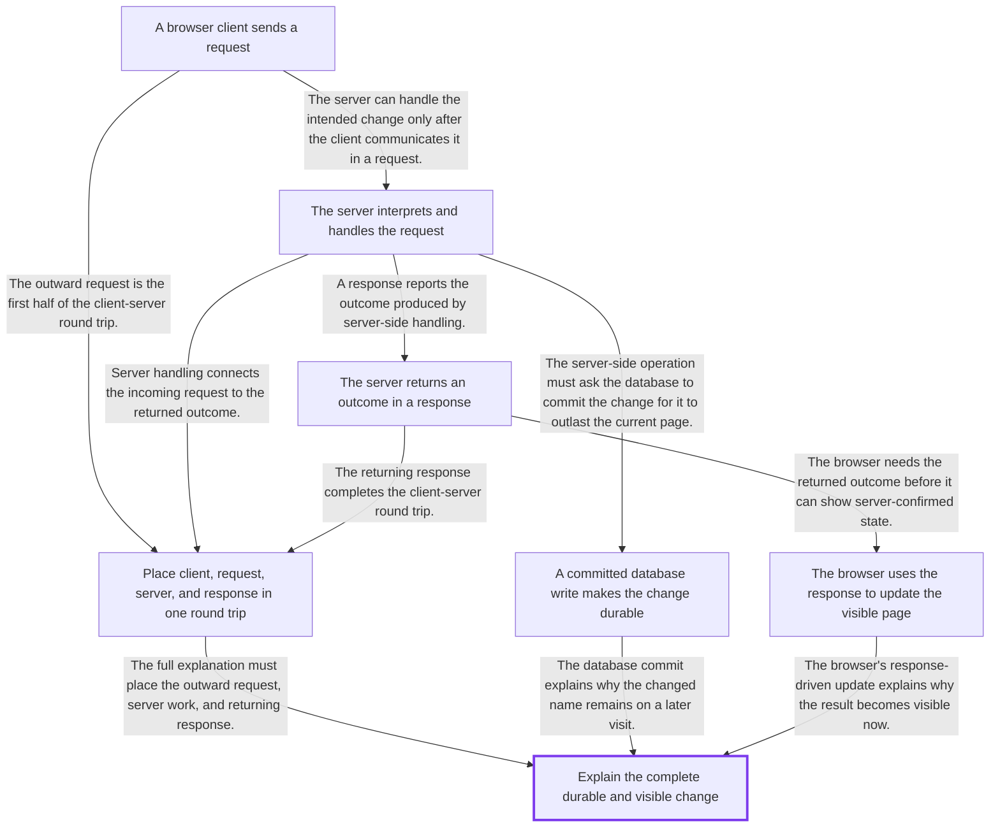

# Browser-to-database request and response flow

- **Session:** `e89f7607-ce37-41c5-aca2-b351d5dadd43`
- **Phase:** Complete
- **Created:** 2026-08-24T20:06:31.248Z
- **Updated:** 2026-08-24T20:26:04.361Z
- **Completed:** 2026-08-24T20:26:04.361Z

## Learning target

Explain how a browser action becomes a durable database change and returns a visible response.

## Learner context

The learner can use a web application but cannot yet place client, server, request, response, and database roles. The initial probe must locate the client-server and persistence branches.

## Probe conclusion

Demonstrated: the learner recognizes that the browser can change what is visible on the current page. Fragile: 'probably saves it somewhere online' does not place or connect any mechanism. Missing by explicit admission: the request-server-response round trip and the durable persistence mechanism that survives a later visit. Not yet checked: transfer of these roles to a new scenario; the admitted mechanisms must be taught before testing.

## Dependency plan

## Admitted gaps

### client-server-round-trip

- **Learner statement:** I do not know what the request, response, or server do.
- **Diagnostic evidence:** The learner explicitly states that the request, response, and server roles in the browser-to-server round trip are unknown.
- **Classification:** Not an assessment; no grade or retry was created.

### durable-database-persistence

- **Learner statement:** I do not know which part makes the name still be Bea when I return tomorrow.
- **Diagnostic evidence:** The learner explicitly states that the mechanism making the changed name survive a later visit is unknown.
- **Classification:** Not an assessment; no grade or retry was created.

## Sources and verification

### [RFC 9110: HTTP Semantics, Sections 3.3-3.4](https://www.rfc-editor.org/rfc/rfc9110.html#section-3.3)

- **Class:** primary
- **Supports:** In HTTP, a client sends request messages to a server, and the server services those requests by sending response messages.
- **Verification:** Retrieved RFC 9110 directly in the terminal and checked Sections 3.3 and 3.4 for the client, server, request, and response definitions.

### [SQLite Is Transactional](https://www.sqlite.org/transactional.html)

- **Class:** primary
- **Supports:** A committed database transaction is durable: its changes survive program, operating-system, and power failures under the documented transaction guarantees.
- **Verification:** Retrieved SQLite's official transactional documentation directly in the terminal and checked its ACID durability and all-or-nothing transaction statements.

## Teaching steps

### 1. client-request

- **Foundation:** In this web-application scenario, the browser is the client program the learner directly uses, and it can react to the Save click on the current page.
- **Motivation:** Changing one browser page cannot by itself communicate the intended change to the separate server.
- **Explanation:** The client sends an outward request message containing the intended change to the server. A request communicates the client's intent; it is not the server's work and it is not a returned result.
- **Checkpoint:** Suppose a checkout page sends a newly entered shipping address from the browser to the web application's remote side. What role is the browser playing, what is the outgoing message called, and in which direction does that message travel?

### 2. server-processing

- **Foundation:** The client-request checkpoint established that the browser sends a request outward to the remote server.
- **Motivation:** A request arriving is only information; something on the remote side must interpret it and carry out the application's intended operation.
- **Explanation:** The server receives and services the request. Its application code interprets what the client asked for and performs or coordinates that operation. The server is the actor at this point; the request is its input. This step does not yet establish a durable database write or a returned response.
- **Checkpoint:** A library website's browser sends a request that says 'renew loan 42'. Before any database write or response is considered, which component receives and interprets that request, and what is that component's job at this point?

### 3. durable-database-persistence

- **Foundation:** The server-processing checkpoint established that server-side application logic interprets the request and coordinates the requested operation.
- **Motivation:** Work performed only in temporary server memory can disappear, so it cannot explain why a changed value remains for a later visit or after a restart.
- **Explanation:** For durable state, the server asks the database to write the change and the database commits that write. The commit is the persistence event: under the database's durability guarantee, the stored value survives beyond the current request and process lifetime. A browser page change alone does not establish this.
- **Checkpoint:** A profile server receives 'change timezone to UTC' and updates only a temporary in-memory variable. After the server restarts, the old timezone returns. In this browser-server-database model, what missing database event caused the failure to persist, and what would that event have guaranteed?

### 4. server-response

- **Foundation:** The learner has established that a client request reaches the server, the server handles it, and a committed database write can make the resulting state durable.
- **Motivation:** Because the work occurs remotely, the browser still needs a message from the server telling it what outcome occurred.
- **Explanation:** The server sends a response message back to the client. The response can carry an outcome such as success, failure, or returned data. Its direction is server to client; it reports the server-side outcome but is not itself the database commit.
- **Checkpoint:** An online store's server has processed 'add item to wishlist' and now sends a message containing status 'saved' and the updated item back to the browser. What is this returning message called, which component sends it, and in which direction does it travel?

### 5. client-server-round-trip

- **Foundation:** The learner has separately established the outward client request, the server's handling role, and the returning server response.
- **Motivation:** Knowing those labels separately is not enough to explain how one browser action and one returned outcome form a connected exchange.
- **Explanation:** Compose the roles into one round trip: the browser acts as client and sends a request to the server; the server receives and handles it; then the server sends a response back to the browser client. The request is the outward leg and the response is the return leg. Database persistence is a separate branch inside the server-side work.
- **Checkpoint:** A travel app's browser asks to cancel booking 73, and the server later returns status 'cancelled'. Reconstruct the client-server round trip in order using the browser client, request, server, and response, and state the direction of both messages; leave the database branch out of this answer.

### 6. visible-response-update

- **Foundation:** The learner has established that the server sends a response carrying the operation's outcome back to the browser client, while the database commit separately provides durability.
- **Motivation:** A response can reach the browser without the user seeing the returned outcome if the client does not apply it to the displayed page.
- **Explanation:** In this web-application model, browser-side client code reads the response's status or data and updates the visible page. That rendering step makes the returned outcome visible; it does not create the durable database state.
- **Checkpoint:** A settings page sends a theme-change request, the server commits the new dark theme, and the response containing 'saved: dark' reaches the browser; however, the page still displays the old light theme because the browser code ignores the response. Which step is missing between response arrival and visible confirmation, and which component must perform it?

### 7. durable-visible-change

- **Foundation:** The learner has established the client-server request and response round trip, the committed database write that provides durability, and the browser-side rendering step that provides visible confirmation.
- **Motivation:** The target requires one causal explanation that preserves the distinction between the persistence branch and the visible-response branch instead of treating 'saved' as one undefined event.
- **Explanation:** On a successful save path, the browser client sends a request to the server; the server handles it and asks the database to write and commit the change; after that successful outcome, the server sends a response to the browser; browser-side code reads the response and updates the page. The database commit makes the value durable for later requests, while browser rendering makes the returned outcome visible now.
- **Checkpoint:** A notes-app user edits a title and clicks Save. Reconstruct the successful path from that click to both a durable database value and visible confirmation, using browser client, request, server, database commit, response, and browser rendering; explicitly distinguish which step makes the title durable from which step makes it visible.

## Active learning checkpoint

- **Status:** Resolved
- **Node:** `durable-visible-change`
- **Question ID:** `teach-durable-visible-change-q1`
- **Kind:** reconstruction
- **Question:** A notes-app user edits a title and clicks Save. Reconstruct the successful path from that click to both a durable database value and visible confirmation, using browser client, request, server, database commit, response, and browser rendering; explicitly distinguish which step makes the title durable from which step makes it visible.
- **Attempts:** 1
- **Prior question ID:** None
- **Resolved evidence:** `0126bb84-52dd-4e18-9638-a4aaa3760492`
- **Mistake type:** None

## Assessments

### Correct — client-request

- **Kind:** transfer
- **Evidence:** The learner correctly identifies the browser as the client, names the outgoing message as a request, and gives its direction from the browser client to the remote server.
- **Contaminated:** No

### Correct — server-processing

- **Kind:** transfer
- **Evidence:** The learner correctly identifies the server as the receiving and interpreting component, explains that it runs or coordinates the application's requested operation, and distinguishes the request as the server's input.
- **Contaminated:** No

### Correct — durable-database-persistence

- **Kind:** debugging
- **Evidence:** The learner correctly identifies a committed database write as the missing persistence event and explains durability as survival beyond temporary server memory, across restart, and into later requests.
- **Contaminated:** No

### Correct — server-response

- **Kind:** transfer
- **Evidence:** The learner correctly names the returning message as a response, identifies the server as sender and browser client as recipient, gives the server-to-client direction, and recognizes that it carries the operation's outcome and returned data.
- **Contaminated:** No

### Correct — client-server-round-trip

- **Kind:** reconstruction
- **Evidence:** The learner reconstructs the complete round trip in causal order: browser as client, request from client to server, server handling, and response from server back to client.
- **Contaminated:** No

### Correct — visible-response-update

- **Kind:** debugging
- **Evidence:** The learner correctly identifies browser-side response interpretation and rendering as the missing visible-update step, assigns it to the browser client, and clearly distinguishes database durability from response-driven visibility.
- **Contaminated:** No

### Correct — durable-visible-change

- **Kind:** reconstruction
- **Evidence:** The learner reconstructs the complete successful path in causal order, places every required role, identifies the database commit as the durability mechanism, and distinguishes browser-side response rendering as the visibility mechanism.
- **Contaminated:** No

### Correct — whole-system-synthesis

- **Kind:** synthesis
- **Evidence:** The learner synthesizes the complete causal flow, correctly separates committed durability from response-driven visibility, and transfers the model to a lost-response case: durable database state can exist without current-page confirmation and can be retrieved by a later request.
- **Contaminated:** No

## Retention

- **client-server-round-trip:** developing; level 1; due 2026-08-25T20:23:02.380Z
- **durable-database-persistence:** developing; level 1; due 2026-08-25T20:18:23.109Z
- **A browser client sends a request:** developing; level 1; due 2026-08-25T20:16:22.851Z
- **The server interprets and handles the request:** developing; level 1; due 2026-08-25T20:17:19.809Z
- **The server returns an outcome in a response:** developing; level 1; due 2026-08-25T20:19:16.416Z
- **The browser uses the response to update the visible page:** developing; level 1; due 2026-08-25T20:24:00.547Z
- **Explain the complete durable and visible change:** developing; level 1; due 2026-08-25T20:24:59.931Z

## Visuals

No visuals recorded.

## Whole-system synthesis

On the successful path, the browser client sends a request with the changed meeting title to the server. The server interprets and handles the request, then asks the database to write and commit the new title. That database commit makes the title durable for later requests even after the current page or process ends. The server then sends a response with the saved outcome back to the browser, and browser-side code reads the response and renders the new title or a confirmation, which makes the result visible to the user. If the database commit succeeds but the response never reaches the browser, the new title is still durable in the database, but the current browser cannot render a server-confirmed result, so the user may continue to see the old title or no success confirmation. A later request can retrieve the committed new title.

## Unresolved gaps

None recorded.
