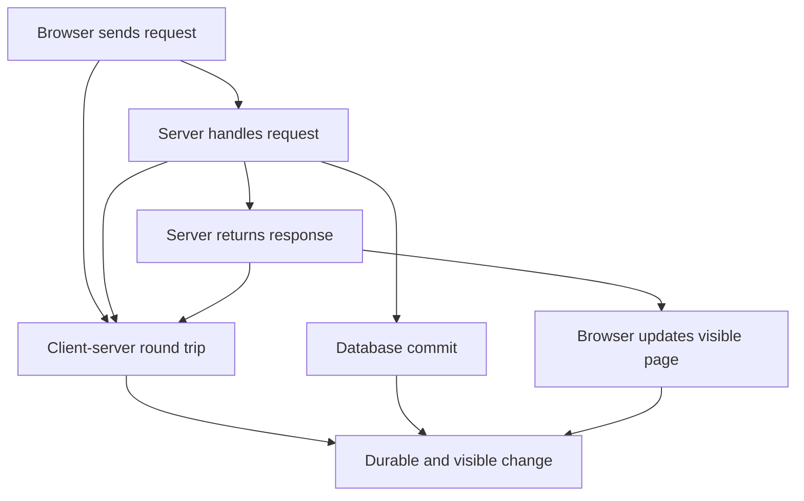

# Live Codex acceptance transcript

## User

You are the live Codex host for behavioral acceptance scenario novice-branches version 1. The learner target is: Explain how a browser action becomes a durable database change and returns a visible response. The learner can use a web application but cannot yet place client, server, request, response, and database roles. The initial probe must locate the client-server and persistence branches. Use /private/tmp/adaptive-codex-acceptance.3fZ8E3 as the fresh learning root. Load and follow AGENTS.md and .agents/skills/adaptive-learning/SKILL.md, including all referenced protocols. Initialize canonical state and persist every required transition before advancing. Do not modify repository files; write learning state only under the disposable learning root. Do not simulate learner replies. Ask at most one fully framed question, then wait for the learner response. This acceptance run is terminal-only: never use Browser, browser-control, Chrome, Chromium, Playwright, CDP, Oracle, any browser process, or port 9222. If research is needed, use direct terminal retrieval or local authoritative sources only.

## Assistant

I’m loading the adaptive-learning protocol and will initialize only the disposable learning root. I’ll persist the session state before asking the single diagnostic question, then wait for your reply.

## Assistant

I’ve read the Superpowers bootstrap and I’m using the requested adaptive-learning skill to run the probe and persistence workflow exactly as defined. I’m now resolving its local protocols from the fresh root before writing state.

## Assistant

The Superpowers loader does not index this repository-local skill, so I’m following the mandated fallback: reading the local `SKILL.md` itself and every protocol it references. No learning-state write has occurred yet.

## Assistant

The protocol is fully loaded. The fresh root contains no local protocol files, so I’m using the repository’s read-only engine at `/Users/0xkato/Desktop/Hobby/adaptive-learning-agent/bin/learn.mjs` while directing every mutation to `/private/tmp/adaptive-codex-acceptance.3fZ8E3`. The broad probe will cover both the browser↔server boundary and what makes a change persist.

## Assistant

Target: explain how a browser action becomes a durable database change and returns a visible response.

Imagine you change a display name from “Ana” to “Bea” and click **Save**: what happens from that click until “Bea” appears on screen, what roles do the browser/client, request, server, database, and response play, and what makes the change remain after you close the browser and return tomorrow?

## User

Synthetic learner reply for the approved acceptance fixture: The browser changes the name on the page and probably saves it somewhere online. I do not know what the request, response, or server do, and I do not know which part makes the name still be Bea when I return tomorrow. Continue the adaptive-learning session from canonical state. Do not simulate another learner reply. Ask at most one fully framed question and then wait. Keep all mutations inside /private/tmp/adaptive-codex-acceptance.3fZ8E3. Terminal only: do not invoke Browser, browser-control, Oracle, Playwright, Chrome, Chromium, CDP, port 9222, or any browser-capable fallback.

## Assistant

I’m reloading the adaptive-learning protocol for this continuation, then I’ll read canonical context before recording the learner’s explicitly admitted gaps. Those admissions will remain diagnostic—no fabricated grade or retry.

## Assistant

Canonical state confirms the session is still in `probe`. The reply cleanly bounds both required branches: the client–server round trip is admitted missing, and durable persistence is separately admitted missing. I’m recording those as two gaps with no assessment, grade, or retry.

## Assistant

The probe is now closed with the visible browser update as fragile prior knowledge and both missing branches explicit. Before teaching, I’m checking primary sources directly in the terminal: the HTTP standard for request/response roles and SQLite’s official transaction documentation for durability.

## Assistant

The terminal checks support two narrow claims: RFC 9110 defines the client as the request sender and the server as the response sender; SQLite documents committed transactions as durable through crashes and power failure. I’m storing those claims separately so the lesson won’t blur HTTP transport with database persistence.

## Assistant

The validated route will keep the two branches distinct: the request enters server-side handling; from there one branch commits durable data, while the other returns a response that the browser can render. They join only at the final “durable and visible” target.

## Assistant

The DAG validated successfully and the engine set `client-request` as the first frontier. I’m persisting that one teaching move and its exact transfer checkpoint before showing either to you.

## Assistant

Your reply located both missing branches, so I recorded them as admitted gaps—not incorrect answers.

Current frontier: **browser → request**. RFC 9110 is our source for the HTTP roles; SQLite’s transaction documentation will ground the later durability branch.

**Foundation:** The browser is acting as the client and can react to a click locally.

**Problem:** Changing the current page does not communicate the intended change to a separate server.

**Move:** The client sends an outward **request** containing its intent. This is communication to the server—not yet the server’s work or a returned result.

Suppose a checkout page sends a newly entered shipping address from the browser to the web application's remote side. What role is the browser playing, what is the outgoing message called, and in which direction does that message travel?

## User

A context interruption occurred. Resume from canonical state without asking me to repeat stored context. Do not answer the pending question and do not simulate a learner reply. Show only what the learner needs to continue, including the exact pending question already stored. Keep all mutations inside /private/tmp/adaptive-codex-acceptance.3fZ8E3. Terminal only: do not invoke Browser, browser-control, Oracle, Playwright, Chrome, Chromium, CDP, port 9222, or any browser-capable fallback.

## Assistant

I’m using the adaptive-learning protocol to resume from canonical state. I’ll inspect the stored checkpoint without changing it, then return only the exact pending question.

## Assistant

Suppose a checkout page sends a newly entered shipping address from the browser to the web application's remote side. What role is the browser playing, what is the outgoing message called, and in which direction does that message travel?

## User

Synthetic learner reply for the persisted checkpoint: The browser is the client. The outgoing message is a request, and it travels from the browser client to the remote server. Continue from canonical state, persist the exact assessment before grading, do not simulate another learner reply, ask at most one fully framed question, and then wait. Keep all mutations inside /private/tmp/adaptive-codex-acceptance.3fZ8E3. Terminal only: no Browser, Oracle, Playwright, Chrome, Chromium, CDP, port 9222, or browser-capable fallback.

## Assistant

I’m using the adaptive-learning protocol to resume the stored checkpoint. I’ll first read canonical state, then persist the exact learner answer and assessment; no grade will be shown unless that write succeeds.

## Assistant

The assessment write succeeded, and canonical state advanced the frontier to `server-processing`. I’m now persisting the next single teaching move and its exact checkpoint before presenting them.

## Assistant

**Correct:** You identified the browser as the client, the outgoing message as a request, and its direction from client to server.

**Next move:** The request is only information. The server receives it, interprets what the client asked for, and performs or coordinates the operation. This does not yet establish a durable database write or a returned response.

A library website's browser sends a request that says 'renew loan 42'. Before any database write or response is considered, which component receives and interprets that request, and what is that component's job at this point?

## User

Synthetic learner reply for the exact persisted checkpoint: The server receives and interprets the 'renew loan 42' request. Its job at this point is to run the application's logic for the requested renewal or coordinate that operation; the request is its input. Continue from canonical state, persist the exact assessment before grading, do not simulate another learner reply, ask at most one fully framed question, and then wait. Keep all mutations inside /private/tmp/adaptive-codex-acceptance.3fZ8E3. Terminal only: no Browser, Oracle, Playwright, Chrome, Chromium, CDP, port 9222, or browser-capable fallback.

## Assistant

I’m using the adaptive-learning protocol to resume the stored checkpoint. I’ll verify its exact identity in canonical state, persist the learner’s exact answer and assessment, and only then provide the grade and next checkpoint.

## Assistant

The assessment is durably recorded, and canonical state now exposes both next branches: `server-response` and `durable-database-persistence`. I’m taking the persistence branch first and persisting its debugging checkpoint before showing the grade or lesson.

## Assistant

**Correct:** You identified the server as the actor, the request as its input, and application logic as the mechanism that performs or coordinates the requested operation.

**Persistence branch:** Temporary server memory can disappear. For durable state, the server asks the database to write the change, and the database **commits** it. That commit—not the page update—makes the value persist beyond the current request or server process.

A profile server receives 'change timezone to UTC' and updates only a temporary in-memory variable. After the server restarts, the old timezone returns. In this browser-server-database model, what missing database event caused the failure to persist, and what would that event have guaranteed?

## User

Synthetic learner reply for the exact persisted checkpoint: The missing event was a database write being committed. A commit would have made the new UTC value durable beyond temporary server memory, so it would still be stored after the server restarted and available on a later request. Continue from canonical state, persist the exact assessment before grading, do not simulate another learner reply, ask at most one fully framed question, and then wait. Keep all mutations inside /private/tmp/adaptive-codex-acceptance.3fZ8E3. Terminal only: no Browser, Oracle, Playwright, Chrome, Chromium, CDP, port 9222, or browser-capable fallback.

## Assistant

I’m using the adaptive-learning protocol to resume the persisted durability checkpoint. I’ll verify canonical identity, store the exact reply and assessment, and show no grade until that write succeeds.

## Assistant

The durability assessment is now stored, and canonical state leaves `server-response` as the sole frontier. I’m persisting that return-path lesson and its exact transfer checkpoint before presenting them.

## Assistant

**Correct:** You identified the committed database write and explained durability precisely: the value survives temporary server memory, a restart, and later requests.

**Return path:** The browser still needs to learn what happened remotely. The server sends a **response** back to the client containing an outcome or returned data. The response reports the result; it is not itself the database commit.

An online store's server has processed 'add item to wishlist' and now sends a message containing status 'saved' and the updated item back to the browser. What is this returning message called, which component sends it, and in which direction does it travel?

## User

Synthetic learner reply for the exact persisted checkpoint: It is a response. The server sends it back to the browser client, so it travels from server to client and carries the saved outcome and updated item. Continue from canonical state, persist the exact assessment before grading, do not simulate another learner reply, ask at most one fully framed question, and then wait. Keep all mutations inside /private/tmp/adaptive-codex-acceptance.3fZ8E3. Terminal only: no Browser, Oracle, Playwright, Chrome, Chromium, CDP, port 9222, or browser-capable fallback.

## Assistant

I’m using the adaptive-learning protocol to resume the stored response checkpoint. I’ll verify the canonical question, persist the learner’s exact answer and assessment, and only then show the grade and next checkpoint.

## Assistant

The response assessment is now durably recorded. Canonical state exposes two frontiers; I’m taking `client-server-round-trip` first so the separate roles become one causal sequence before we connect the visible-page branch.

## Assistant

**Correct:** You identified the response, its server-to-client direction, and its role in carrying the saved outcome and updated data back to the browser.

**Connection:** The client–server round trip is:

`browser client → request → server processing → response → browser client`

The request is the outward leg; the response is the return leg. Database persistence is a separate branch within the server-side work.

A travel app's browser asks to cancel booking 73, and the server later returns status 'cancelled'. Reconstruct the client-server round trip in order using the browser client, request, server, and response, and state the direction of both messages; leave the database branch out of this answer.

## User

The browser is the client. It sends a cancellation request to the server, so the request travels client to server. The server receives and handles the request. It then sends a response with status cancelled back to the browser, so the response travels server to client. Continue the canonical adaptive-learning session in /private/tmp/adaptive-codex-acceptance.3fZ8E3. Persist this exact learner answer and assessment before giving feedback. Do not simulate another learner answer. Ask at most one fully framed checkpoint question and then wait. Keep every mutation inside that disposable learning root. Terminal only: do not use Browser, browser-control, Oracle, Playwright, Chrome, Chromium, CDP, port 9222, or any browser-capable fallback.

## Assistant

I’m using the adaptive-learning protocol to resume the exact stored round-trip checkpoint. I’ll verify canonical state, persist this answer and assessment verbatim, and only then provide feedback and the next checkpoint.

## Assistant

The round-trip assessment is now stored, and canonical state advances to the sole frontier: `visible-response-update`. I’m persisting that final branch lesson and its exact debugging checkpoint before presenting them.

## Assistant

**Correct:** You reconstructed the complete round trip in causal order, including both message directions and the server’s handling role.

**Visible-response branch:** Receiving a response is not enough to change what the user sees. Browser-side client code must read the returned status or data and update the displayed page. That rendering step provides visible confirmation; the database commit separately provides durability.

A settings page sends a theme-change request, the server commits the new dark theme, and the response containing 'saved: dark' reaches the browser; however, the page still displays the old light theme because the browser code ignores the response. Which step is missing between response arrival and visible confirmation, and which component must perform it?

## User

The missing step is the browser-side client code reading the response and updating or rendering the displayed page with the returned dark-theme state. The browser client must perform that visible UI update. The database commit already made the state durable; the response-driven rendering makes it visible. Continue the canonical adaptive-learning session in /private/tmp/adaptive-codex-acceptance.3fZ8E3. Persist this exact learner answer and assessment before giving feedback. Do not simulate another learner answer. Ask at most one fully framed checkpoint question and then wait. Keep every mutation inside that disposable learning root. Terminal only: do not use Browser, browser-control, Oracle, Playwright, Chrome, Chromium, CDP, port 9222, or any browser-capable fallback.

## Assistant

I’m using the adaptive-learning protocol to resume the stored visible-response checkpoint. I’ll verify canonical identity, persist this exact answer and assessment, and only then provide feedback and the next checkpoint.

## Assistant

The visible-response assessment is durably recorded, and canonical state now places the overall target at the frontier. I’m persisting the integration lesson and its exact reconstruction checkpoint before presenting them.

## Assistant

**Correct:** You identified the browser-side rendering step, assigned it to the client, and clearly separated visible confirmation from database durability.

**Integrated path:** On a successful save, the browser sends a request; the server handles it and coordinates a database commit; the server returns a response; then browser-side code renders the returned result. The commit makes the value durable, while rendering makes it visible.

A notes-app user edits a title and clicks Save. Reconstruct the successful path from that click to both a durable database value and visible confirmation, using browser client, request, server, database commit, response, and browser rendering; explicitly distinguish which step makes the title durable from which step makes it visible.

## User

When the user clicks Save, the browser client sends a request containing the edited title to the server. The server receives and handles that request, then asks the database to write and commit the new title. The database commit is what makes the value durable beyond the current page or server process and available to later requests. After the successful commit, the server sends a response with the saved result back to the browser. Browser-side code reads that response and renders the updated title or confirmation on the page. That final rendering step makes the result visible now; it is not what made the title durable. Continue the canonical adaptive-learning session in /private/tmp/adaptive-codex-acceptance.3fZ8E3. Persist this exact learner answer and assessment before giving feedback. Do not simulate another learner answer. Ask at most one fully framed checkpoint question and then wait. Keep every mutation inside that disposable learning root. Terminal only: do not use Browser, browser-control, Oracle, Playwright, Chrome, Chromium, CDP, port 9222, or any browser-capable fallback.

## Assistant

I’m using the adaptive-learning protocol to resume the stored target checkpoint. I’ll verify canonical identity, persist the exact answer and assessment, and only after that write succeeds will I provide feedback and—if canonical state requires it—the persisted whole-system synthesis checkpoint.

## Assistant

The target assessment is durably recorded and the dependency frontier is complete. Because canonical state still requires whole-system synthesis, I’m persisting one new transfer question before presenting it.

## Assistant

**Correct:** You reconstructed every required role in causal order and clearly separated the two outcomes: the database commit makes the title durable, while browser-side response rendering makes it visible.

**Whole-system synthesis:** Now transfer that model to a case where durability and visible confirmation diverge.

A calendar-app user changes a meeting title and clicks Save. Explain the complete successful path through browser client, request, server, database commit, response, and browser rendering; then predict the state if the database commit succeeds but the response never reaches the browser, distinguishing whether the title is durable from whether the user sees confirmation.

## User

On the successful path, the browser client sends a request with the changed meeting title to the server. The server interprets and handles the request, then asks the database to write and commit the new title. That database commit makes the title durable for later requests even after the current page or process ends. The server then sends a response with the saved outcome back to the browser, and browser-side code reads the response and renders the new title or a confirmation, which makes the result visible to the user. If the database commit succeeds but the response never reaches the browser, the new title is still durable in the database, but the current browser cannot render a server-confirmed result, so the user may continue to see the old title or no success confirmation. A later request can retrieve the committed new title. Continue the canonical adaptive-learning session in /private/tmp/adaptive-codex-acceptance.3fZ8E3. Persist this exact synthesis answer and assessment before giving feedback, then close the learning session if canonical state permits. Do not simulate another learner answer. Keep every mutation inside that disposable learning root. Terminal only: do not use Browser, browser-control, Oracle, Playwright, Chrome, Chromium, CDP, port 9222, or any browser-capable fallback.

## Assistant

I’m using the adaptive-learning protocol to resume the stored synthesis checkpoint. I’ll verify its exact identity, persist this answer and synthesis assessment verbatim, and only then close the session if canonical state allows it.

## Assistant

The synthesis assessment is now durably recorded as resolved and correct. Canonical state has no remaining frontier or retry, so I’m closing the learning session and then checking the resulting review schedule.

## Assistant

**Correct:** You demonstrated the complete causal flow and correctly handled the lost-response case: committed state remains durable even when the browser cannot show server-confirmed success.

The learning session is closed.

- Unresolved gaps: none recorded.
- Retention: not yet established.
- Seven reviews are scheduled for August 25, 2026, between `20:16:22Z` and `20:24:59Z`.
- No reviews are currently due.
