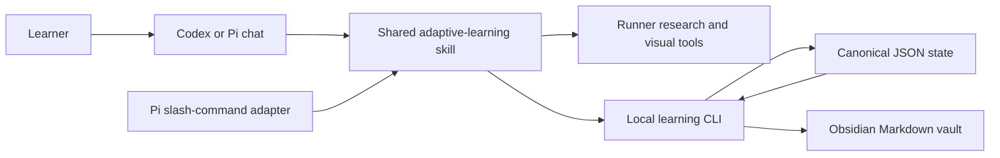

# Adaptive Learning Agent Design

## Purpose

Build a local, chat-first learning system that gives one learner a consistent,
trusted interface over many sources. It must diagnose the learner's current
understanding, plan a dependency path to a learner-supplied target, teach at the
edge of understanding, verify comprehension continuously, preserve the session
as an Obsidian-readable artifact, and retain calibration across sessions.

The system supports both Codex and Pi. The durable learning state belongs to
the repository, not to either runner's conversation history.

## Feature matrix

| Area | Defined by the videos | Explicit improvement in this project | Acceptance evidence |
| --- | --- | --- | --- |
| Learning target | The learner states the desired understanding in the initial `teach` request. | Target and optional context are persisted. An active target is never changed silently; a different target requires closing the session and starting a new one. | Starting a session creates a durable target in state and the Obsidian note. |
| Probe | Begin broad, then binary-search each prerequisite strand until the edge of understanding is mapped. | Probes may use explanation, prediction, transfer, reconstruction, or debugging in addition to multiple choice. | Probe records identify node, kind, grade, evidence, and whether the question was contaminated. |
| Planning | Reason out the route from current understanding to the target and show it as a Mermaid dependency graph. | The engine validates that the graph is acyclic and that every dependency is defined before teaching begins. | Invalid graphs fail without changing state; valid graphs render in the session note. |
| Research | The agent handles resource discovery, verification, and fact-checking; the learner should not manage those logistics. | Source choices and claim support remain visible in the conversation and ledger, but do not require one-by-one approval. | Sources store provenance, supported claim, source class, and verification note. |
| Teaching | Start from unconditional foundations and definitions, motivate every move, and advance one reasoning step at a time. | Every step records its foundation, motivating problem, explanation, and checkpoint. The agent cannot rush through the whole plan in one response. | The skill contract and session log enforce one active step and a checkpoint before advancing. |
| Feedback | Quiz periodically for learner feedback, system calibration, practice, and consolidation. | Grades are exactly Correct, Partial, or Incorrect; first misses do not expose answers; leaked questions are discarded; follow-ups use new transfer tasks. | Assessment records, retry state, and contamination behavior are unit-tested. |
| Retention | The videos emphasize durable structured understanding but do not specify a scheduler. | Correct answers expand review intervals; partial/incorrect answers shorten them; due reviews and whole-system synthesis are explicit. | Deterministic scheduler tests and a due-review command. |
| Visuals | Generate visuals when useful, inspect them, and embed them in the learning artifact. | Visuals require a description and verification note before being linked. Mermaid remains the default dependency visualization. | Visual metadata and embeds appear in the note. |
| Persistence | Link the chat session to Markdown and use Obsidian as the readable UI and durable artifact. | Structured JSON is canonical; Markdown is a derived, inspectable view. Atomic writes and a lock protect the local state. | Restart and concurrent-mutation tests preserve valid state. |
| Runners | The demonstration uses Pi skills/extensions. | One Agent Skill works in both Codex and Pi; a small Pi extension adds `/teach`, `/learn-status`, and `/learn-review`. | Shared-skill contract test and Pi extension command-registration test. |

## Considered approaches

### 1. Prompt-only skill

This is simplest, but state would depend on model discipline and chat history.
It cannot reliably validate graphs, schedule retention, prevent contaminated
questions from counting, or keep Codex and Pi synchronized.

### 2. Standalone tutoring application with its own model API

This provides maximum control but duplicates the model, tools, authentication,
research access, and conversation interface already supplied by Codex and Pi.
It also creates another interface, contrary to the video's one-interface goal.

### 3. Hybrid local engine plus runner adapters — selected

A deterministic Node.js CLI owns state transitions, graph validation, review
scheduling, and Markdown rendering. A shared Agent Skill owns the pedagogical
workflow and tells the active runner how to research, probe, plan, teach, and
record evidence. Pi receives convenience slash commands; Codex discovers the
same skill directly. This keeps cognition in the capable host model while
making the critical learning record deterministic and runner-independent.

## Architecture

### Components

- `bin/learn.mjs`: command-line boundary and human-readable errors.
- `src/`: state schema, atomic store, phase machine, DAG validation, retention
  scheduler, and Markdown renderer.
- `.agents/skills/adaptive-learning/`: the runner-neutral teaching workflow.
- `.pi/extensions/adaptive-learning.js`: Pi convenience commands that invoke
  the CLI and send the skill invocation into chat.
- `.adaptive-learning/state.json`: canonical local state, created at runtime.
- `vault/`: Obsidian-compatible notes generated from canonical state.

## Session lifecycle

1. `start`: persist topic, target, learner context, and enter `probe`.
2. `record-probe`: store a complete diagnostic result. The skill starts broad
   and narrows prerequisite strands based on evidence.
3. `finish-probe`: persist the current-understanding synthesis and enter
   `plan`. At least one valid probe is required.
4. `set-plan`: accept a JSON DAG, validate it, render Mermaid, and identify the
   first teachable frontier.
5. `begin-teach`: enter `teach` only when a valid plan exists.
6. `record-step`: add exactly one motivated reasoning step.
7. `record-assessment`: update node evidence, retry/contamination state, and
   review schedule. The next step is not opened until the checkpoint is
   resolved.
8. `add-source` and `add-visual`: attach verified evidence at any relevant
   phase.
9. `close`: write a synthesis, unresolved gaps, and future reviews.

`status`, `context`, and `due` are read-only and allow either runner to resume
without trusting compressed chat memory.

## Assessment and retry rules

- Grades are `correct`, `partial`, or `incorrect` only.
- The evidence field must state exactly what the learner demonstrated or
  missed; a label alone is rejected.
- A first genuine miss opens a retry and stores the mistake type without
  storing a revealed solution.
- A second miss may be taught, after which a new transfer question is required.
- A contaminated question is excluded from mastery and review calculations.
- Clarification records do not count as assessments.
- The latest clarification is the answer assessed.

## Retention model

Each knowledge node owns a review level and due date. A correct, uncontaminated
transfer result advances through intervals of 1, 3, 7, 14, 30, and 60 days.
A partial result moves back one level and is due the next day. An incorrect
result resets the level and is due the next day after teaching. A whole-system
synthesis becomes due every seventh completed review and whenever three or
more related nodes are simultaneously due.

This is a scheduling heuristic, not proof of mastery. Mastery claims remain
bounded by the recorded assessment kind and evidence.

## Failure handling

- Mutations acquire a short-lived lock and write through a temporary file plus
  atomic rename.
- Invalid phase transitions, malformed JSON, cycles, missing dependencies, and
  missing evidence fail before mutation.
- Renderer failure does not corrupt canonical state; the next successful
  command regenerates the vault.
- Runner or research failure is recorded as a gap and does not fabricate a
  source or verification result.
- No network credential or model API key is stored by the engine.

## Test strategy

- Unit tests: graph validation, scheduling, grading/contamination, phase
  transitions, slug/path safety, and Markdown rendering.
- Integration tests: CLI lifecycle in a temporary repository and persistence
  across independent processes.
- Runner tests: load the Pi extension against a fake extension API and inspect
  the shared skill contract required by both runners.
- End-to-end test: simulate a complete session from target through probing,
  verified plan, one teaching step, first miss, retry, successful transfer,
  closeout, and due-review generation; inspect both state and vault output.

## Claim boundary

Passing these tests proves that the local orchestration, persistence, runner
integration, and pedagogical guardrails behave as specified. It does not prove
that every host model will teach well, that every researched source is true, or
that a learner has mastered a topic. Those remain evidence-dependent outcomes.
