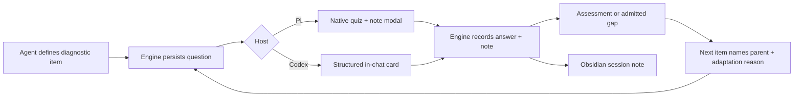

# Interactive Adaptive Learning Design

**Date:** 2026-08-25

## Problem

The current repository persists learning sessions and teaches through an Agent
Skill, but it does not implement the interaction demonstrated in the reference
video. A new session can begin with an ordinary free-response prompt, there is
no native multiple-choice quiz surface, and a learner cannot attach a note to
the question they are answering. That is the failed acceptance boundary this
design repairs.

## Product contract

For a new learning target, the system must:

1. begin calibration with a graded multiple-choice item rather than an
   unbounded request to explain the entire topic;
2. include an explicit **I don't know** choice that is not treated as a guess;
3. let the learner attach an optional note to the exact item before submitting;
4. persist the item before it is shown and persist the response before the host
   gives assessment feedback;
5. use each result to justify the next, easier, harder, or adjacent diagnostic
   item;
6. preserve the question, displayed choice order, response, note, and adaptive
   link in canonical state and the Obsidian session note;
7. use one shared state model in Pi and Codex.

The existing retry and contamination rules remain authoritative. A first miss
is recorded before feedback, but the correct answer is not revealed while that
same question remains a required retry. An **I don't know** response is an
admitted gap: it should lead to teaching rather than a fabricated assessment.

## Considered approaches

### 1. Prompt-only multiple choice

The skill could print A/B/C/D and ask the learner to type a letter. This works
in both hosts with no extension work, but it does not build the requested Pi
interface and cannot make note capture a first-class part of the submission.

### 2. Pi-only quiz extension

A standalone Pi tool could show the desired modal. It would solve the visible
interaction but leave question identity, notes, resume behavior, Obsidian, and
Codex on a separate path. The two runners would drift.

### 3. Shared interaction model with host adapters — selected

The deterministic Node engine owns question and note records. Pi adds a native
custom quiz tool over that lifecycle. Codex follows the same lifecycle through
a strict in-chat card and the same CLI commands. This gives Pi the requested
interaction without pretending that a repository skill can create unsupported
Codex UI.

## State model

Schema version 3 adds two session collections.

### `questions`

Each question stores:

- stable ID, stage, concept/node, question kind, and prompt;
- single- or multi-select mode;
- choices in the exact display order, keyed by stable values;
- correct choice values, retained for deterministic grading;
- lifecycle status covering `awaiting-answer`, `awaiting-assessment`, retry,
  resolved, admitted-gap, cancelled, and contaminated outcomes;
- selected values or the separate `dontKnow` signal;
- computed correctness, assessment link, and response time;
- optional parent question and an explicit adaptation reason.

Correct choice values are canonical engine data. Read-only learner-facing
commands always redact them and the stored explanation. The Pi renderer must
not place either in the tool-call preview; host feedback may use the supplied
explanation only after persisted retry state permits it.

### `notes`

Each note stores a stable ID, target type, target ID, body, and timestamps.
Question notes are created atomically with the answer. The generic note command
also supports session, concept, and teaching-step targets so a learner can add
a note to whichever learning object matters.

## Interaction lifecycle

The engine rejects a second unanswered question in the same session. This
prevents the agent from silently changing the question after it has been shown.

## Pi adapter

The Pi extension registers an `adaptive_learning_quiz` tool. Its parameters use
stable choice values and require the correct value plus a concise explanation.
The tool:

1. validates and persists the question;
2. opens `ctx.ui.custom()` in TUI mode;
3. renders choices, **I don't know**, and a note editor on one surface;
4. records cancellation or answer through the CLI;
5. returns the persisted result to the model;
6. shows feedback without leaking an answer needed by the retry protocol.

Non-TUI Pi modes return an explicit unavailable result instead of guessing or
silently falling back to an unpersisted interaction.

## Codex adapter

Official Codex skills package instructions and resources; they do not define a
project-local custom input component. The Codex contract therefore requires the
agent to persist a question, show one compact numbered card, accept a choice and
an optional `Note:` line, then persist the response before assessing it. This
is the same state machine, not a claim of UI parity.

## Adaptive behavior

Every calibration item after the first must record both `parentQuestionId` and
`adaptationReason`. The reason states what the prior response changed, for
example:

- `correct; test a harder prerequisite boundary`;
- `incorrect; narrow to the immediate prerequisite`;
- `I don't know; record the admitted gap and stop testing that mechanism`;
- `correct on one strand; move to the next declared prerequisite strand`.

This does not hard-code subject-matter questions into the engine. It makes the
agent's adaptive decision inspectable and prevents an unrelated sequence from
being described as adaptive.

## Migration and safety

Reading schema version 2 creates an owner-only backup, adds empty question and
note collections to every session, writes schema version 3 atomically, and
then renders. The existing live Transformer session is not touched during
development; all implementation and tests run in an isolated worktree with
temporary learning roots.

## Acceptance criteria

- The first probe question is persisted before answer capture.
- The learner can select one choice, **I don't know**, or cancel.
- A note is attached to the exact question and rendered in Obsidian.
- Learner-facing pending-question output does not expose the answer key.
- A second pending question is rejected.
- The next question records why it followed the prior answer.
- Pi registers and executes the custom quiz tool in the fake host harness.
- The shared skill requires the Pi tool when available and the Codex persisted
  card when it is not.
- Schema 2 migrates deterministically to schema 3 with a backup.
- The complete test and release checks pass without mutating live state.
